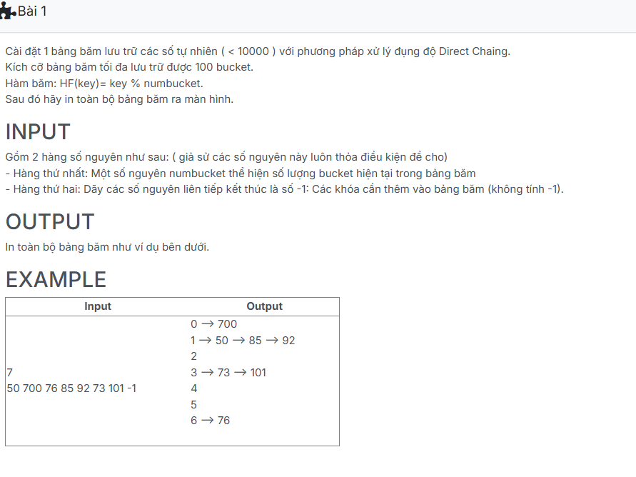

```c++

#include <iostream>
using namespace std;
#define M 100

struct NODE {
    int key;
    NODE *pNext;
};
// Khai báo kiểu con trỏ chỉ node
typedef NODE *NODEPTR;
typedef NODEPTR HASHTABLE[M];

NODE* CreateNode(int x) {
	NODE* p;
	p = new NODE;
	p->key = x;
	p->pNext = NULL;
	return p;
}
void AddTail(NODE* &head, int x) {
	NODE *p=CreateNode(x);
    if (head == NULL) head = p;
	else {
        NODE* i=head;
        while(i->pNext!=NULL){
            i=i->pNext;
        }
        i->pNext=p;
    }
}

int HF(int numbucket, int key) { return key % numbucket; }

void CreateHashTable(HASHTABLE &H, int &numbucket) {
    cin >> numbucket;
    for(int i = 0; i <numbucket; i++){
        H[i] = NULL;
    }
    int key;
    while(true){
        cin >> key;
        if(key == -1) break;
        int b = HF(numbucket, key);
        AddTail(H[b], key);
    }
}

void Traverse(HASHTABLE &H, int numbucket) {
    for(int i=0; i<numbucket; i++){
        cout << i;
        NODE* p = H[i];
        while(p != NULL){
            cout << " --> " << p->key;
            p = p->pNext;
        }
        cout << endl;
    }
}
int main(){
    HASHTABLE H;
    int numbucket;

    CreateHashTable(H, numbucket);
    Traverse(H, numbucket);

    return 0;
}

```