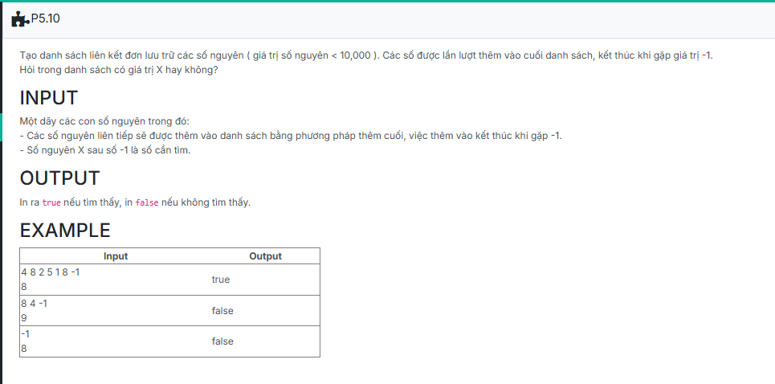

``` c++
#include <bits/stdc++.h>

using namespace std;

struct NODE
{
    int data;
    NODE *pNext;
};

typedef struct NODE *node;

struct LIST
{
	node pHead;
	node pTail;
};

void CreateEmptyList(LIST &L)
{
	L.pHead = NULL;
	L.pTail = NULL;
}

node CreateNode(int x)
{
    node p = new NODE;
    if (p == NULL) return NULL;

    p->data = x;
    p->pNext = NULL;
    return p;
}

void AddTail(LIST &L, node p)
{
	if (L.pHead == NULL)
	{
		L.pHead = p;
		L.pTail = L.pHead;
	}
	else
	{
		{
			L.pTail->pNext = p;
			L.pTail = p;
		}
	}
}

void CreateList(LIST &L)
{
	
	int x;
	while (cin >> x)
	{
		if (x == -1) break;
			
		node tmp = CreateNode(x);
		AddTail(L, tmp);
	}

}

string searchX(node p, int x) {

	if (p == NULL) 
	return "false";

	while (p != NULL)
	{
		if (p->data == x) return "true";
		p = p->pNext;
	}

	return "false";
}

//Template
int main() {
    LIST L;
	int X;
	CreateEmptyList(L);

	CreateList(L);
	std::cin >> X;
	cout << searchX(L.pHead, X);

    return 0;
}
```