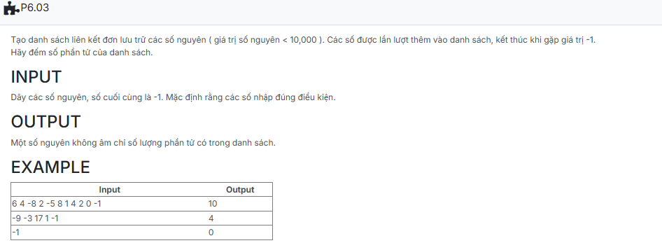

```c++

//template
#include <iostream>
using namespace std;
//insert code

struct NODE
{
    int data;
    NODE *pNext;
};

typedef struct NODE *node;

struct LIST
{
    node pHead;
    node pTail;
};

void CreateEmptyList(LIST &L)
{
    L.pHead = NULL;
    L.pTail = NULL;
}

node CreateNode(int x)
{
    node p = new NODE;
    if (p == NULL) return NULL;

    p->data = x;
    p->pNext = NULL;
    return p;
}

void AddTail(LIST &L, node p)
{
    if (L.pHead == NULL)
    {
        L.pHead = p;
        L.pTail = L.pHead;
    }
    else
    {
        L.pTail->pNext = p;
        L.pTail = p;
    }
}

void CreateList(LIST &L)
{
    int x;
    while (cin >> x)
    {
        if (x == -1) break;
        node tmp = CreateNode(x);
        AddTail(L, tmp);
    }
}

int length(LIST L)
{
    node p = L.pHead;
    int count = 0;
    if (p == NULL) return 0;

    while (p != NULL)
    {
        count++;
        p = p->pNext;
    }
    return count;
}

//insert code


//template
int main() {
    LIST L;
	CreateEmptyList(L);

	CreateList(L);

    cout << length(L);

    return 0;
}

```