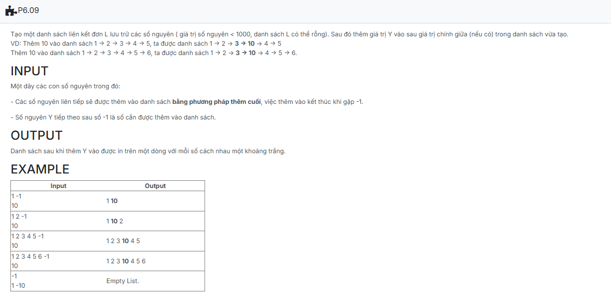

```c++

#include <iostream>
using namespace std;
//insert code

struct NODE
{
    int data;
    NODE *pNext;
};

typedef struct NODE *node;

struct LIST
{
    node pHead;
    node pTail;
};

void CreateEmptyList(LIST &L)
{
    L.pHead = NULL;
    L.pTail = NULL;
}

node CreateNode(int x)
{
    node p = new NODE;
    if (p == NULL) return NULL;

    p->data = x;
    p->pNext = NULL;
    return p;
}

void AddTail(LIST &L, node p)
{
    if (L.pHead == NULL)
    {
        L.pHead = p;
        L.pTail = L.pHead;
    }
    else
    {
        L.pTail->pNext = p;
        L.pTail = p;
    }
}

void CreateList(LIST &L)
{
    int x;
    while (cin >> x)
    {
        if (x == -1) break;
        node tmp = CreateNode(x);
        AddTail(L, tmp);
    }
}

void add_after_middle(LIST &L, int Y) {
    if (L.pHead == NULL) return;
   
    int count = 0;
    node tmp = L.pHead;
    while (tmp != NULL) {
        count++;
        tmp = tmp->pNext;
    }
  
    int mid = (count - 1) / 2;
    node current = L.pHead;
    for (int i = 0; i < mid; ++i) {
        current = current->pNext;
    }

    node newNode = CreateNode(Y);
    newNode->pNext = current->pNext;
    current->pNext = newNode;
    
    
    if (newNode->pNext == NULL) {
        L.pTail = newNode;
    }
}

void PrintList(LIST L)
{
    node tmp = L.pHead;
    if (tmp == NULL)
    {
        cout << "Empty List.";
        return;
    }

    while (tmp != NULL)
    {
        cout << tmp->data << " ";
        tmp = tmp->pNext;
    }
}

//template
int main() {
    LIST L;
	int X, Y;

	CreateEmptyList(L);

	CreateList(L);

	std::cin >> Y;
	add_after_middle(L, Y);

	PrintList(L);

    return 0;
}

```