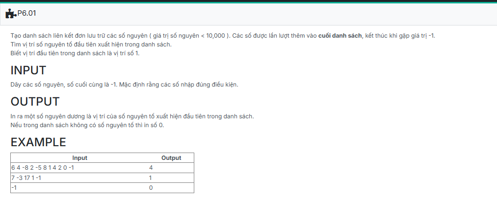

```c++
#include <iostream>
using namespace std;
//insert code

struct NODE
{
    int data;
    NODE *pNext;
};

typedef struct NODE *node;

struct LIST
{
    node pHead;
    node pTail;
};

void CreateEmptyList(LIST &L)
{
    L.pHead = NULL;
    L.pTail = NULL;
}

node CreateNode(int x)
{
    node p = new NODE;
    if (p == NULL) return NULL;

    p->data = x;
    p->pNext = NULL;
    return p;
}

void AddTail(LIST &L, node p)
{
    if (L.pHead == NULL)
    {
        L.pHead = p;
        L.pTail = L.pHead;
    }
    else
    {
        L.pTail->pNext = p;
        L.pTail = p;
    }
}

void AddHead(LIST &L, node p)
{
    if (L.pHead == NULL)
    {
        L.pHead = p;
        L.pTail = L.pHead;
    }
    else
    {
        p->pNext = L.pHead;
        L.pHead = p;
    } 
}

void AddAfterX(LIST &L, NODE* x, NODE* y) 
{
    if (x != NULL) 
    {
        y->pNext = x->pNext;
        x->pNext = y;
        if (L.pTail == x)
        L.pTail = y;
    
    }
    else
        AddHead(L, y); 
   
}

node FindX(LIST L, int x) 
{
    node p = L.pHead;
    while (p != NULL) 
	{
        if (p->data == x)
            return p;
        p = p->pNext;
    }
    return NULL;
}

void CreateList(LIST &L) {
    int cmd;
    while (cin >> cmd) 
	{
        if (cmd == -1)
            break;
        if (cmd == 0) 
		{
            int x;
            cin >> x;
            node p = CreateNode(x);
            AddHead(L, p);
        } else if (cmd == 1) 
		{
            int x;
            cin >> x;
            node p = CreateNode(x);
            AddTail(L, p);
        } else if (cmd == 2) 
		{
            int x, y;
            cin >> x >> y;
            node found = FindX(L, x);
             if (found != NULL) 
			 {
                node p = CreateNode(y);
                AddAfterX(L, found, p);
            }
        }
    }
}

void PrintList(LIST L) {
    if (L.pHead == NULL) 
	{
        cout << "Empty List.";
        return;
    }
    node p = L.pHead;
    while (p != NULL)
	{
        cout << p->data;
        if (p->pNext != NULL) cout << " ";
        p = p->pNext;
    }
}

//template
int main() {
    LIST L;

	L.pHead=L.pTail=NULL;

	CreateList(L);

	PrintList(L);

    return 0;
}
```