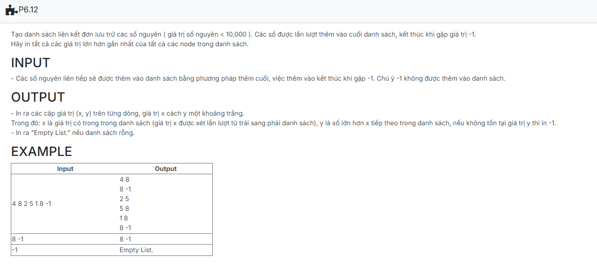

```c++

#include <iostream>
using namespace std;
//insert code

struct NODE
{
    int data;
    NODE *pNext;
};

typedef struct NODE *node;

struct LIST
{
    node pHead;
    node pTail;
};

void CreateEmptyList(LIST &L)
{
    L.pHead = NULL;
    L.pTail = NULL;
}

node CreateNode(int x)
{
    node p = new NODE;
    if (p == NULL) return NULL;

    p->data = x;
    p->pNext = NULL;
    return p;
}

void AddTail(LIST &L, node p)
{
    if (L.pHead == NULL)
    {
        L.pHead = p;
        L.pTail = L.pHead;
    }
    else
    {
        L.pTail->pNext = p;
        L.pTail = p;
    }
}

void CreateList(LIST &L)
{
    int x;
    while (cin >> x)
    {
        if (x == -1) break;
        node tmp = CreateNode(x);
        AddTail(L, tmp);
    }
}

void Function(node head)
{
    node p = head;

    if (p == NULL)
    {
        cout << "Empty List.";
        return;
    }

    for (p = head; p != NULL; p = p->pNext)
    {
        node q = p->pNext;
        bool found = false;
        while (q != NULL)
        {
            if (q->data > p->data)
                {
                    cout << p->data << " " << q->data << endl;
                    found = true;
                    break;
                }
                q = q->pNext;
        }
        if (!found) cout << p->data << " " << -1 << endl;
    }
}


int main() {
    LIST L;
	int X;
	CreateEmptyList(L);

	CreateList(L);

	Function(L.pHead);

    return 0;
}

```