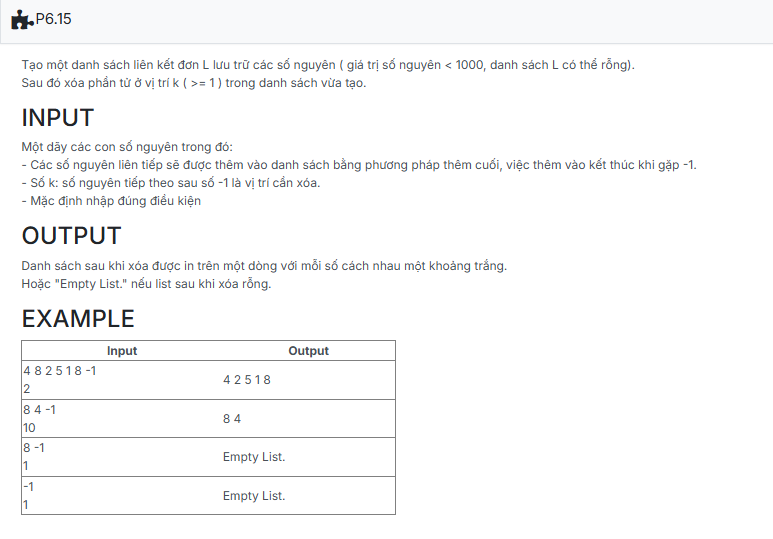

```c++
#include <bits/stdc++.h>

using namespace std;

struct NODE
{
    int data;
    NODE *pNext;
};

typedef struct NODE *node;

struct LIST
{
    node pHead;
    node pTail;
};

void CreateEmptyList(LIST &L)
{
    L.pHead = NULL;
    L.pTail = NULL;
}

node CreateNode(int x)
{
    node p = new NODE;
    if (p == NULL) return NULL;

    p->data = x;
    p->pNext = NULL;
    return p;
}

void AddTail(LIST &L, node p)
{
    if (L.pHead == NULL)
    {
        L.pHead = p;
        L.pTail = L.pHead;
    }
    else
    {
        L.pTail->pNext = p;
        L.pTail = p;
    }
}

void CreateList(LIST &L)
{
    int x;
    while (cin >> x)
    {
        if (x == -1) break;

        node tmp = CreateNode(x);
        AddTail(L, tmp);
    }
}

void Remove_k_th(LIST &L, int pos)
{
    int num_count = 0;
    node tmp = L.pHead;
    while (tmp != NULL)
    {
        tmp = tmp->pNext;
        num_count++;
    }

    if (pos > num_count) return;

    if (pos == 1)
    {
        node temp = L.pHead;
        L.pHead = L.pHead->pNext;
        delete temp;
        if (L.pHead == NULL) L.pTail == NULL;
        return;
    }

    
    node p = L.pHead;
    for (int i = 1; i < pos - 1 && p->pNext != NULL; i++)
    {
        p = p->pNext;
    }

    node del_node = p->pNext;
    p->pNext = del_node->pNext;

    if (del_node == L.pTail)
        L.pTail = p;
    delete del_node;
}

void PrintList(LIST L)
{
    node p = L.pHead;
    
    if (p == NULL)
    {
        cout << "Empty List.";
        return;
    }
 
    while (p != NULL)
    {
        cout << p->data << " ";
        p = p->pNext;
    }
}
//template
int main() {
    LIST L;
	int k;
	CreateEmptyList(L);

	CreateList(L);
	std::cin >> k;
	Remove_k_th(L, k);
    PrintList(L);

    return 0;
}
```