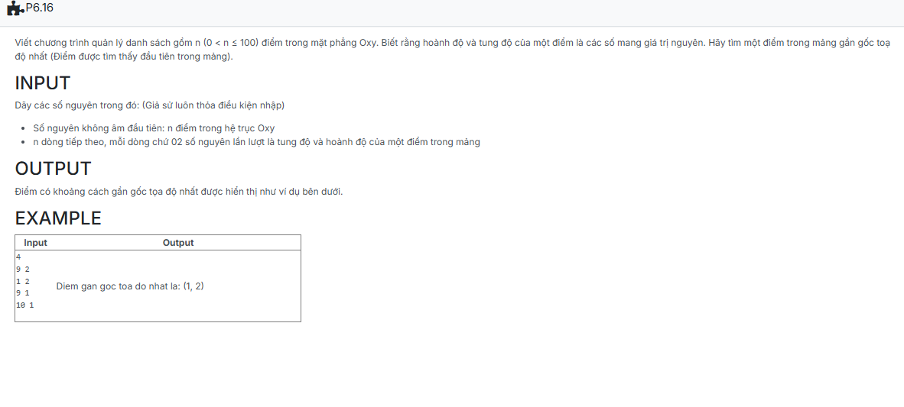

```c++
#include <bits/stdc++.h>

using namespace std;

struct NODE
{
    int x, y;
    NODE *pNext;

    NODE(int x, int y)
    {
        this->x = x;
        this->y = y;
        pNext = NULL;
    }
};

typedef struct NODE *node;

struct LIST
{
    node pHead;
    node pTail;
};

void CreateEmptyList(LIST &L)
{
    L.pHead = NULL;
    L.pTail = NULL;
}

void Nhap(LIST &points)
{
    int n; cin >> n;

    for (int i = 0; i < n; i++)
    {
        int x, y;
        cin >> x >> y;
        node newNode = new NODE(y, x);
        
        if (points.pHead == NULL)
            points.pHead = points.pTail = newNode;
        else
            {
                points.pTail->pNext = newNode;
                points.pTail = newNode;
            }
    }
}

node DiemGanGocToaDoNhat(LIST &points)
{
    node current = points.pHead;
    node closet = NULL;

    int min_dis = INT_MAX;

    while (current != NULL)
    {
        int distance = current->x * current->x + current->y * current->y;
        if (distance < min_dis)
        {
            min_dis = distance;
            closet = current;
        }
        current = current->pNext;
    }
    return closet;
}

void Xuat(node points)
{
    if (points != NULL)
        cout << "(" << points->y << ", " << points->x << ")";
}

int main() {
    LIST points;
    CreateEmptyList(points);
    Nhap(points);

    std::cout << "Diem gan goc toa do nhat la: ";
    Xuat(DiemGanGocToaDoNhat(points));

    return 0;
}
```