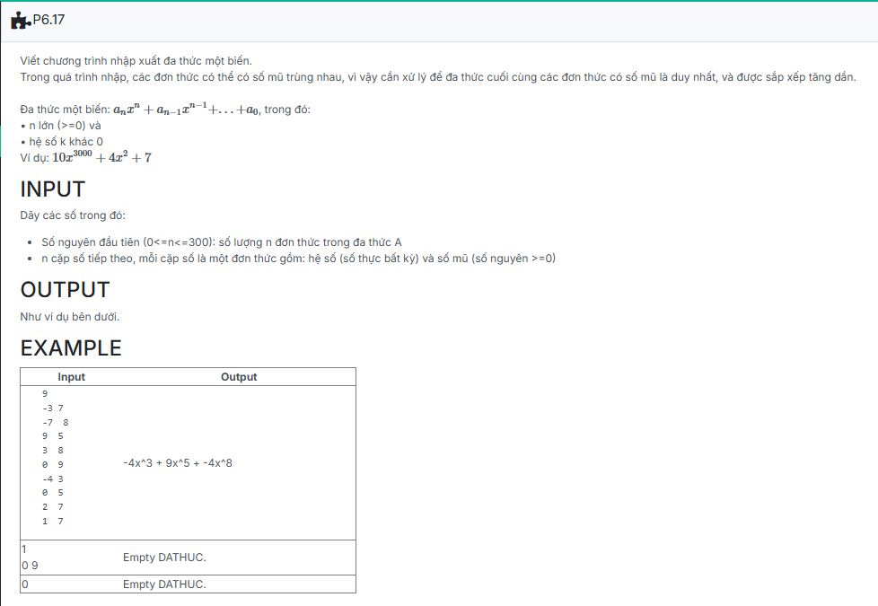

```c++

#include <iostream>
using namespace std;

struct DONTHUC{
    float HeSo;
    int SoMu;
};
struct NODE {
	DONTHUC info;
	NODE* pNext;
};
struct DATHUC {
	NODE* pHead;
	NODE* pTail;
};

typedef struct NODE *node;

bool compare(DONTHUC a, DONTHUC b)
{
    return a.SoMu > b.SoMu;
}
void CreateEmptyDATHUC(DATHUC &L)
{
    L.pHead = L.pTail = NULL;
}

void AddNode(DATHUC &L, DONTHUC dt) 
{
    NODE* p = new NODE;
    p->info = dt;
    p->pNext = NULL;
    if (L.pHead == NULL) 
    {
        L.pHead = L.pTail = p;
    } 
    else 
    {
        L.pTail->pNext = p;
        L.pTail = p;
    }
}


void CreatePolynomial(DATHUC &L) 
{
    int n;
    cin >> n;
    for (int i = 0; i < n; i++) 
    {
        DONTHUC dt;
        cin >> dt.HeSo >> dt.SoMu;
        AddNode(L, dt);
    }


    for (NODE* p = L.pHead; p != NULL; p = p->pNext) 
    {
        for (NODE* q = p->pNext; q != NULL; q = q->pNext) 
        {
            if (p->info.SoMu == q->info.SoMu) 
            {
                p->info.HeSo += q->info.HeSo;
                q->info.HeSo = 0;  
            }
        }
    }

   
    NODE* prev = NULL;
    NODE* current = L.pHead;
    while (current != NULL) 
    {
        if (current->info.HeSo == 0) 
        {
            if (prev == NULL) 
            { 
                L.pHead = current->pNext;
                delete current;
                current = L.pHead;
            } 
            else 
            {  
                prev->pNext = current->pNext;
                delete current;
                current = prev->pNext;
            }
        } 
        else 
        {
            prev = current;
            current = current->pNext;
        }
    }

    
    for (NODE* i = L.pHead; i != NULL; i = i->pNext) 
    {
        for (NODE* j = i->pNext; j != NULL; j = j->pNext) 
        {
            if (i->info.SoMu > j->info.SoMu) 
            {
                swap(i->info, j->info);
            }
        }
    }
}
void SortPolynomial(DATHUC &L) 
{
    if (L.pHead == NULL) return;

    for (NODE* i = L.pHead; i != NULL; i = i->pNext) 
    {
        for (NODE* j = i->pNext; j != NULL; j = j->pNext) 
        {
            if (i->info.SoMu < j->info.SoMu) 
            {
                swap(i->info, j->info);
            }
        }
    }
}
void Output(DONTHUC a){
    if(a.HeSo==-1) cout << "-";
	else if(a.HeSo==1) cout << "";
	else cout << a.HeSo;

    if(a.SoMu==0) cout << "";
	else if(a.SoMu==1) cout << "x";
	else if(a.SoMu<1) cout << "-x";
    else // s.SoMu>1
		cout << "x^" << a.SoMu;
}

void Output(DATHUC L) {
	NODE* p;

	if (L.pHead == NULL)
		cout << "Empty DATHUC.";
	else {
		p = L.pHead;
		Output(p->info);
		p=p->pNext;
		while (p) {
			cout << " + "; Output(p->info);
			p = p->pNext;
		}
	}
}

int main() {
    DATHUC poly;
	CreateEmptyDATHUC(poly);
    CreatePolynomial(poly);
	Output(poly);
	return 0;
}


```