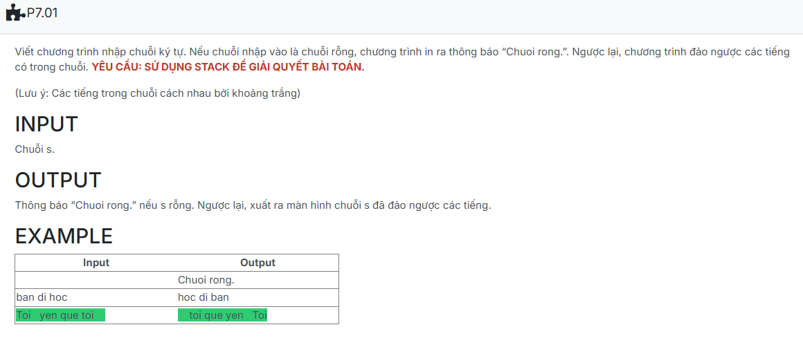

```c++

#include <iostream>
#include <string>
#include <string.h>
using namespace std;
#define MAX 300

struct NODE
{
    string data;
    NODE *pNext;
};

typedef NODE *node;

struct stack
{
    node pHead;
    node pTail;
};

void CreateEmptyStack(stack &s)
{
    s.pHead = NULL;
    s.pTail = NULL;
}

int isEmpty(stack &s)
{
    if (s.pHead == NULL)
        return 1;
    return 0;
}

node CreateNode(string x)
{
    node p = new NODE;
    if (p == NULL)
        exit(1);

    p->data = x;
    p->pNext = NULL;
    return p;
}

void push(stack &s, string x)
{
    node p = CreateNode(x);
    p->pNext = s.pHead;
    s.pHead = p;
}

bool pop(stack &s, string &x)
{
    if (isEmpty(s))
        return false;

    node p = s.pHead;
    x = p->data;
    s.pHead = s.pHead->pNext;
    delete p;
    return true;
}

void StringReverse(string& s) 
{
    stack st;
    CreateEmptyStack(st);

    int i = 0, n = s.length();

    while (i < n) 
    {
        if (s[i] == ' ') {
            string space = "";
            while (i < n && s[i] == ' ') space += s[i++];
            push(st, space);
        } 
        else 
        {
            string word = "";
            while (i < n && s[i] != ' ') word += s[i++];
            push(st, word);
        }
    }

    string result = "";
    string tmp;
    while (pop(st, tmp)) 
        result += tmp;
    

    s = result;
}

int main () {
    string s;

    getline(std::cin, s);	//Nhap chuoi s

    if(s.empty() == true)
        cout << "Chuoi rong." << endl;
    else {
        StringReverse(s);
        cout << s << endl;

    }

    return 0;
}

```