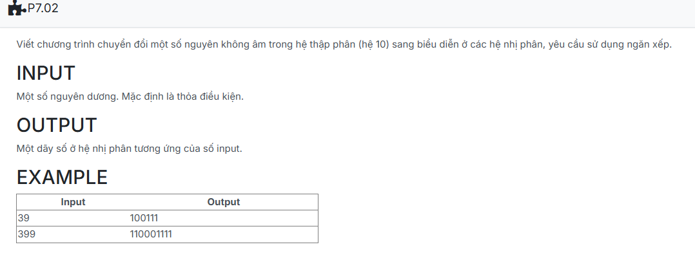

```c++
#include <bits/stdc++.h>

using namespace std;

struct NODE
{
    int info;
    NODE *pNext;
};

typedef NODE *node;

struct Stack
{
    node pHead;
    node pTail;
};

void CreateEmptyStack(Stack &s)
{
    s.pHead = NULL;
    s.pTail = NULL;
}

int isEmpty(Stack &s)
{
    return s.pHead == NULL;
}

node CreateNode(int x)
{
    node p = new NODE;
    if (p == NULL) return NULL;

    p->info = x;
    p->pNext = NULL;
    return p;
}

void push(Stack &s, node p)
{
    if (s.pHead == NULL)
    {
        s.pHead = p;
        s.pTail = s.pHead;
    }
    else
    {
        p->pNext = s.pHead;
        s.pHead = p;
    }
}

int pop(Stack &s, int &x)
{
    node p;
    if (!isEmpty(s))
        if (s.pHead != NULL)
        {
            p = s.pHead;
            x = p->info;
            s.pHead = s.pHead->pNext;
            if (s.pHead == NULL)
                s.pTail = NULL;
            delete p;
            return 1;
        }
    return 0;
}

void decimal_to_binary(int n)
{
    Stack s;
    CreateEmptyStack(s);

    if (n == 0)
        push(s,CreateNode(0));
    else
        while (n > 0)
        {
            int bit = n % 2;
            push(s, CreateNode(bit));
            n /= 2;
        }
    int bit;
    while (pop(s, bit))
        cout << bit;
}


int main() {
    int n;
    cin >> n;
    decimal_to_binary(n);
    return 0;
}
```