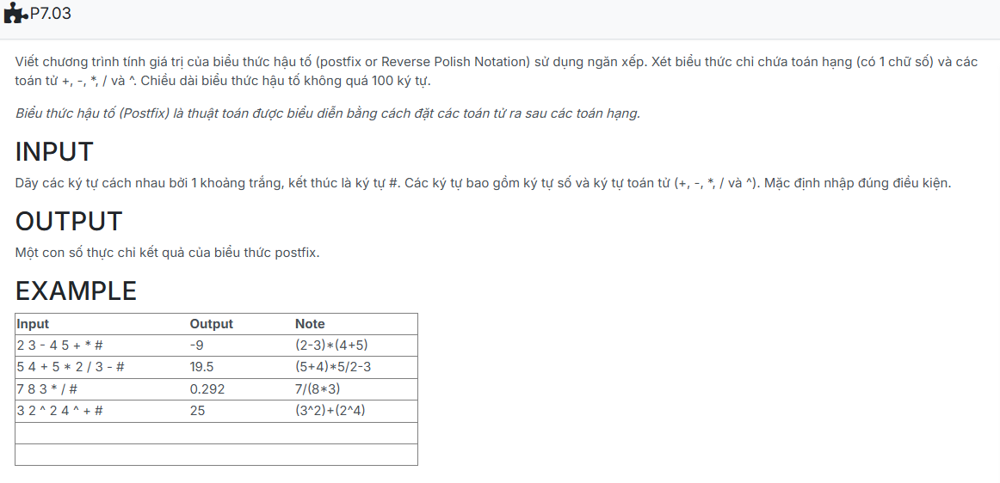

```c++
#include <iostream>
#include <cmath>
using namespace std;
#define MAXN 100

struct NODE{
    float info;
    NODE *pNext;
};

NODE *CreateNode(float x){
    NODE *p=new NODE;
    p->info=x;
    p->pNext=NULL;
    return p;
}
struct stack{
    NODE *top;
};
bool empty(const stack &s){
    return (s.top==NULL);
}
void CreateEmptyStack(stack &s){
    s.top=NULL;
}
void push(stack &s, float x){
    NODE *p=CreateNode(x);
    if(s.top==NULL) s.top= p;
    else {
        p->pNext=s.top;
        s.top=p;
    }
}
void pop (stack &s) {
    if(s.top==NULL) return;
    NODE *p= s.top;
    s.top=s.top->pNext;
    delete p;
}
float& top(stack s) {
    return s.top->info;
}
bool isOperator(char x){
    return ( (x=='-') || (x=='+') || (x=='*') || (x=='/') || (x=='^') );
}
bool isBracket(char x){
    return ( (x=='(') || (x==')') );
}
void InputPostFix(char postix[], int &n){
    char k;
    cin >> k;
    n=0;
    while (k!='#'){
        postix[n++] = k;
        cin >> k;
    }
}

float evaluate_expression(char postfix[], int n)
{
    stack s;
    CreateEmptyStack(s);

    for (int i = 0; i < n; i++)
    {
        char token = postfix[i];

        if (isdigit(token))
            push(s, token - '0');
        else if (isOperator(token))
        {
            float b = top(s); pop(s);
            float a = top(s); pop(s);

            float result = 0;
            switch(token)
            {
                case '+': result = a + b; break;
                case '-': result = a - b; break;
                case '*': result = a * b; break;
                case '/': result = a / b; break;
                case '^': result = pow(a,b); break;
            }
            push(s, result);
        }
    }
    return top(s);
}

int main() {
    char postfix[MAXN];
    int np;

    InputPostFix(postfix, np);
    // Output(postfix, np);

    cout.precision(3);
    cout << evaluate_expression(postfix, np);

    return 0;
}

```