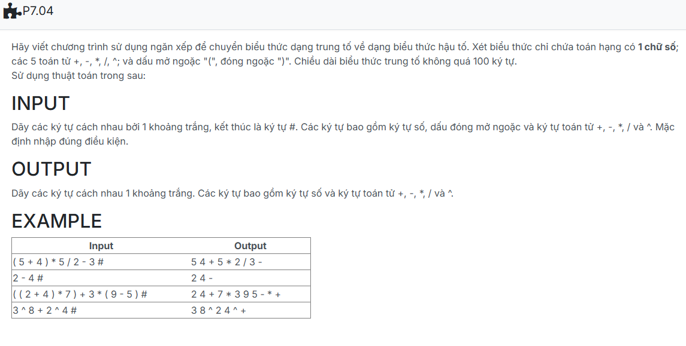

```c++

#include <iostream>
using namespace std;
#define MAXN 100

struct NODE{
    char info;
    NODE *pNext;
};

typedef struct NODE *node;
struct stack
{
    node top;
};

void CreateEmptyStack(stack &s)
{
    s.top = NULL;
}

bool isEmpty(stack s)
{
    return s.top == NULL;
}

void push(stack &s, char x)
{
    node p = new NODE;
    p->info = x;
    p->pNext = s.top;
    s.top = p;
}

char top(stack s)
{
    if (!isEmpty(s))
        return s.top->info;
    return '\0';
}

void pop(stack &s)
{
    if (!isEmpty(s))
    {
        node p = s.top;
        s.top = s.top->pNext;
        delete p;
    }
}

int getPriority(char x) {
    if (x == '+' || x == '-') return 1;
    if (x == '*' || x == '/') return 2;
    if (x == '^') return 3;
    return 0;
}

bool isRightAssociative(char op) {
    return op == '^';
}

bool isOperator(char c)
{
   
    return (c == '+' || c == '-' || c == '*' || c == '/' || c == '^');
}

void Input_infix(char infix[], int &n)
{
    n = 0;
    char token;
    while (cin >> token && token != '#') {
        if (token == ' ') continue; 
        infix[n++] = token;
    }
}

void infix_to_postfix(char infix[], int ni, char postfix[], int &np)
{
    stack s;
    CreateEmptyStack(s);
    np = 0;

    for (int i = 0; i < ni; i++)
    {
        char c = infix[i];

        if (isdigit(c)) postfix[np++] = c;
        else if (c == '(') push(s, c);
        else if (c == ')')
        {
            while (!isEmpty(s) && top(s) != '(')
            {
                postfix[np++] = top(s);
                pop(s);
            }
            if (!isEmpty(s) && top(s) == '(') pop(s);
        }
        else if (isOperator(c))
        {
            while (!isEmpty(s) && top(s) != '(' &&
                   (getPriority(top(s)) > getPriority(c) ||
                    (getPriority(top(s)) == getPriority(c))))
            {
                postfix[np++] = top(s);
                pop(s);
            }
            push(s, c);
        }
    }
    while (!isEmpty(s))
    {
        if (top(s) != '(')
            postfix[np++] = top(s);
        pop(s);
    }
}

void Output(char postfix[], int np) {
    for (int i = 0; i < np; i++) {
        cout << postfix[i];
        if (i < np - 1) cout << ' '; 
    }
}

int main() {
    char infix[MAXN], postfix[MAXN];
    int ni, np;

    Input_infix(infix, ni);

    infix_to_postfix(infix, ni, postfix, np);

    Output(postfix, np);

    return 0;
}

```