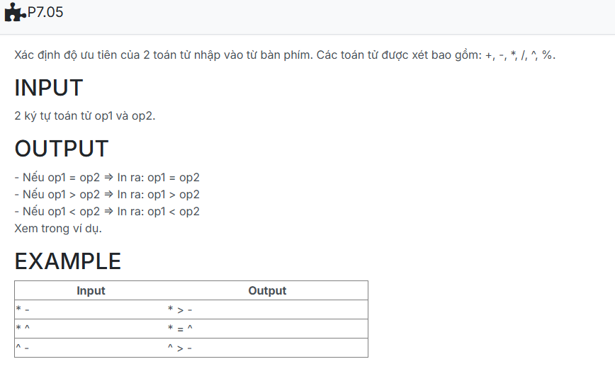

```c++
#include <iostream>
#include <iomanip>
using namespace std;

struct NODE_CHAR {
    char info;
    NODE_CHAR *pNext;
};

struct stack {
    NODE_CHAR *top;
};

NODE_CHAR *CreateNode(char x) {
    NODE_CHAR *p = new NODE_CHAR;
    p->info = x;
    p->pNext = NULL;
    return p;
}

typedef struct NODE_CHAR* node;

void CreateEmptyStack(stack &s) {
    s.top = NULL;
}

bool empty(stack s) {
    return s.top == NULL;
}

void push(stack &s, char x) {
    node p = CreateNode(x);
    p->pNext = s.top;
    s.top = p;
}

void pop(stack &s) {
    if (empty(s)) return;
    node tmp = s.top;
    s.top = s.top->pNext;
    delete tmp;
}

char top(stack s) {
    if (!empty(s)) return s.top->info;
    return '\0';
}

int getPriority(char x) {
    if (x == '+' || x == '-') return 1;
    if (x == '*' || x == '/' || x == '%') return 2;
    if (x == '^') return 3;
    return 0;
}

bool isOperator(char x) {
    return (x == '+' || x == '-' || x == '*' || x == '/' || x == '%' || x == '^');
}

node input_infix() {
    node head = NULL, tail = NULL;

    for (int i = 0; i < 2; ++i) {
        char x;
        cin >> x;

        node p = CreateNode(x);
        if (head == NULL) {
            head = tail = p;
        } else {
            tail->pNext = p;
            tail = p;
        }
    }
    return head;
}


node infix_to_postfix(node infix) 
{
    char op1 = infix->info;
    char op2 = infix->pNext ? infix->pNext->info : '\0';

    int p1 = getPriority(op1);
    int p2 = getPriority(op2);

    if (p1 == p2)
        cout << op1 << " = " << op2 << endl;
    else if (p1 > p2)
        cout << op1 << " > " << op2 << endl;
    else
        cout << op1 << " < " << op2 << endl;


    while (infix != NULL) 
    {
        node tmp = infix;
        infix = infix->pNext;
        delete tmp;
    }

    return NULL;
}

void out(node head)
{
    node temp;
    while (head != NULL)
    {
        temp = head;
        head = head->pNext;
        delete temp; 
    }
    cout << endl;
}

int main() {
    NODE_CHAR *infix = NULL;
    NODE_CHAR *postfix;

    // Nhập biểu thức infix và chuyển đổi sang postfix
    infix = input_infix();
    postfix = infix_to_postfix(infix);
    out(postfix);

    return 0;
}

```