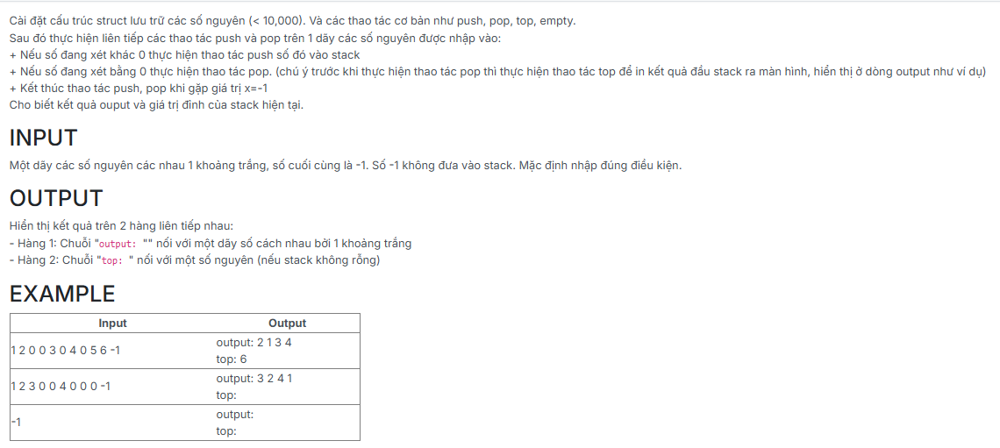

```c++
#include <iostream>
using namespace std;

struct NODE
{
    int data;
    NODE *pNext;
};

typedef struct NODE *node;

struct stack
{
    node top;
};

void CreateEmptyStack(stack &s)
{
    s.top = NULL;
}

bool isEmpty(stack s)
{
    return s.top == NULL;
}

node CreateNode(int x)
{
    node p = new NODE;
    if (p == NULL) return NULL;

    p->data = x;
    p->pNext = NULL;
    return p;
}

void push(stack &s, node p)
{
    if (s.top == NULL)
        s.top = p;
    else
    {
        p->pNext = s.top;
        s.top = p;
    }
}

void pop(stack &s)
{
    if (s.top == NULL) return;

    node p = s.top;
    s.top = s.top->pNext;
    delete p;
}

int top(stack s)
{
    return s.top->data;
}


void Testing_Push_Pop_Top_Stack(stack &s)
{
    CreateEmptyStack(s);
    int x;
    bool hasOutput = false; // Đã in output: hay chưa

    while (cin >> x && x != -1)
    {
        if (x != 0)
        {
            push(s, CreateNode(x));
        }
        else
        {
            if (!isEmpty(s))
            {
                if (!hasOutput)
                {
                    cout << "output:";
                    hasOutput = true;
                }
                cout << " " << top(s);
                pop(s);
            }
        }
    }

    if (!hasOutput)
    {
        cout << "output:" << endl;
    }
    else
    {
        cout << endl;
    }

    cout << "top:";
    if (!isEmpty(s))
    {
        cout << " " << top(s);
    }
    cout << endl;
}

int main() {
    stack s;
	Testing_Push_Pop_Top_Stack(s);
    return 0;
}

```