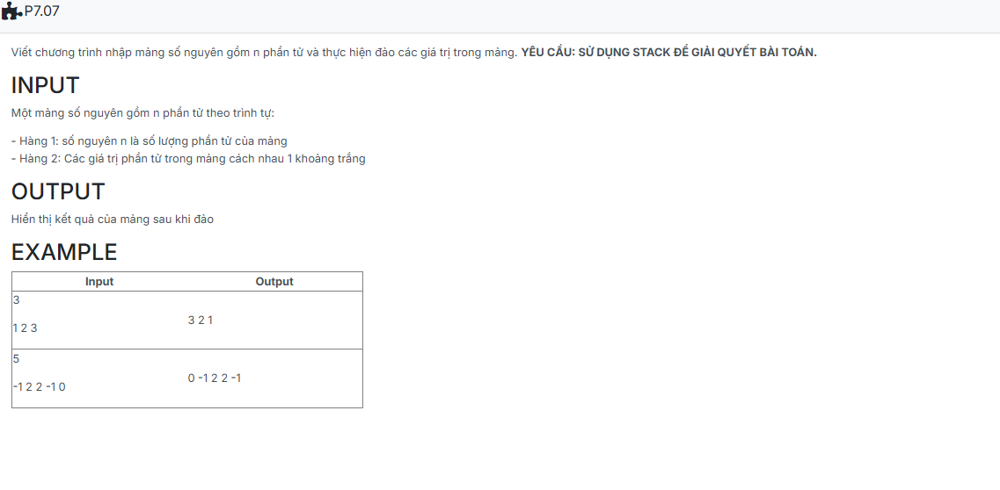

```c++
#include <iostream>
using namespace std;
struct stack {
    int x; 
};

void array_reverse(stack s, int *a, int n) {
    cin >> n; 
    a = new int[n]; 
    for (int i = 0; i < n; i++) cin >> a[i]; 
    for (int i = n - 1; i >= 0; i--) cout << a[i] << ' '; 
}
int main() {
    stack s;
    int a[100], n;
    array_reverse(s,a,n);
    return 0;
}

```