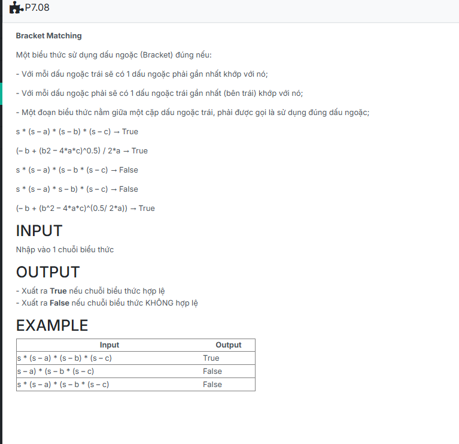

```c++
#include <iostream>

using namespace std;

struct NODE
{
    char data;
    NODE *pNext;
};

typedef struct NODE *node;

struct stack
{
    node top;
};

void CreateEmptyStack(stack &s)
{
    s.top = NULL;
}

bool isEmpty(stack s)
{
    return s.top == NULL;
}

node CreateNode(char x)
{
    node p = new NODE;
    if (p == NULL) return NULL;
    
    p->data = x;
    p->pNext = NULL;
    return p;
}

void push(stack &s, node p)
{
    if (s.top == NULL)
        s.top = p;
    else
    {
        p->pNext = s.top;
        s.top = p;
    }
}

void pop(stack &s)
{
    if (s.top == NULL) return;

    node p = s.top;
    s.top = s.top->pNext;
    delete p;
}

void BracketMatching(stack &s, char str[])
{
    CreateEmptyStack(s);
    cin.getline(str, 100);
    for (int i = 0; str[i] != '\0'; i++)
    {
        if (str[i] == '(')
        {
            node p = CreateNode('(');
            push(s, p);
        }
        else if (str[i] == ')')
        {
            if (isEmpty(s))
            {
                cout << "False" << endl;
                return;
            }
            pop(s);
        }
    }

    if (isEmpty(s))
        cout << "True" << endl;
    else
        cout << "False" << endl;
}

int main() {
    stack s;
    char st[100];
    BracketMatching(s,st);
    return 0;
}

```