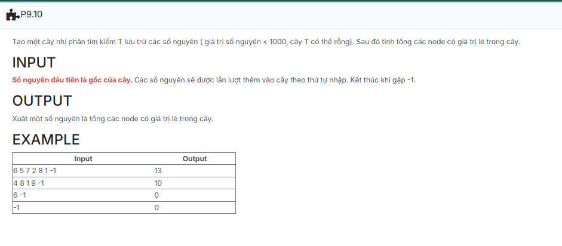

```c++
#include <iostream>
using namespace std;

struct TNODE {
	int key;
	TNODE* pLeft;
	TNODE* pRight;
};
typedef TNODE* TREE;

TREE CreateNode(int x)
{
    TREE p = new TNODE;
    p->key = x;
    p->pLeft = NULL;
    p->pRight = NULL;
    return p;
}

void Insert(TREE &tree, int x)
{
    if (tree == NULL)
    {
        tree = CreateNode(x);
        return;
    }

    if (tree->key == x) return;
    if (x < tree->key) Insert(tree->pLeft, x);
    if (x > tree->key) Insert(tree->pRight, x);
}

void CreateTree(TREE &tree)
{
    int x;
    while (true)
    {
        cin >> x;
        if (x == -1) break;
        Insert(tree, x);
    }
}

int count = 0;
void PrintTree(TREE tree)
{
    if (tree == NULL)
    {
        if (!count) cout << "Empty Tree.";
        return;
    }
    count++;
    PrintTree(tree->pRight);
    cout << tree->key << " ";
    PrintTree(tree->pLeft);
}

int main() {
	TREE T; //hay: TNODE* T;
	T = NULL; // Khoi tao cay T rong, or: CreateEmptyTree(T)
	CreateTree(T);
	PrintTree(T);
	return 0;
}

```