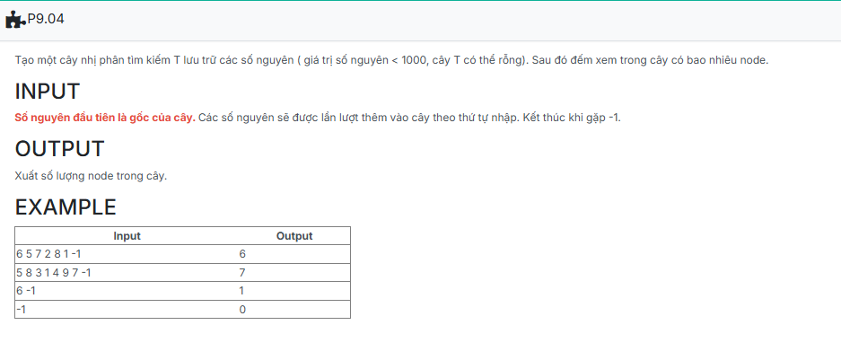

```c++

#include <iostream>
using namespace std;

struct TNODE {
	int key;
	TNODE* pLeft;
	TNODE* pRight;
};
typedef TNODE* TREE;

TNODE* CreateNode(int x) {
	TNODE* p = new TNODE; 
	p->key = x; 
	p->pLeft = NULL;
	p->pRight = NULL;
	return p; 
}

void Insert(TREE &tree, int x) {
	if (tree == NULL) {
		tree = CreateNode(x); 
		return; 
	}
	if (tree->key == x) return;
	if (tree->key < x) Insert(tree->pRight, x); 
	else Insert(tree->pLeft, x); 
}

void CreateTree(TREE &tree) {
	int x; 
	while (true) {
		cin >> x; 
		if (x == -1) break; 
		Insert(tree, x); 
	}
}

int CountNode(TREE tree) {
	if (tree == NULL) return 0; 
	int left = CountNode(tree->pLeft);
	int right = CountNode(tree->pRight); 
	return left + right + 1; 
}TNODE* CreateNode(int x) {
	TNODE* p = new TNODE; 
	p->key = x; 
	p->pLeft = NULL;
	p->pRight = NULL;
	return p; 
}

void Insert(TREE &tree, int x) {
	if (tree == NULL) {
		tree = CreateNode(x); 
		return; 
	}
	if (tree->key == x) return;
	if (tree->key < x) Insert(tree->pRight, x); 
	else Insert(tree->pLeft, x); 
}

void CreateTree(TREE &tree) {
	int x; 
	while (true) {
		cin >> x; 
		if (x == -1) break; 
		Insert(tree, x); 
	}
}

int CountNode(TREE tree) {
	if (tree == NULL) return 0; 
	int left = CountNode(tree->pLeft);
	int right = CountNode(tree->pRight); 
	return left + right + 1; 
}

int main() {
	TREE T; //hay: TNODE* T;
	T = NULL; // Khoi tao cay T rong, or: CreateEmptyTree(T)
	CreateTree(T);
	cout << CountNode(T);
	return 0;
}

```