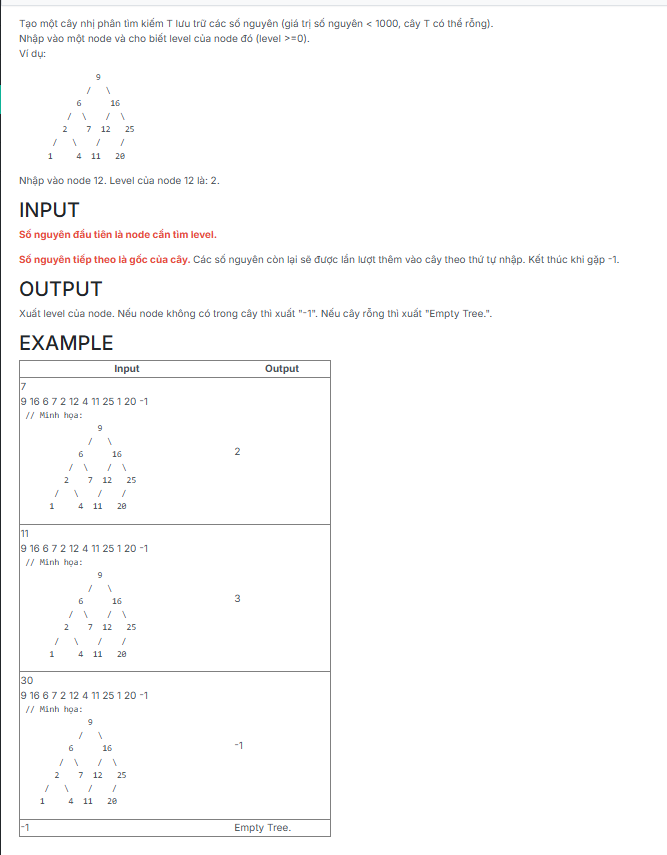

```c++
/*###Begin banned keyword - each of the following line if appear in code will raise error. regex supported
###End banned keyword*/

#include <iostream>
#include <queue>
using namespace std;

struct TNODE {
	int key;
	TNODE* pLeft;
	TNODE* pRight;
};
typedef TNODE* TREE;

TREE CreateNode(int x)
{
    TREE p = new TNODE;
    if (p == NULL) exit(1);
    p->key = x;
    p->pLeft = p->pRight = NULL;
    return p;
}

void CreateEmptyTree(TREE &tree)
{
    tree = NULL;
}

void InsertNode(TREE &tree, int x)
{
    if (tree == NULL)
        tree = CreateNode(x);
    else if (x < tree->key)
        InsertNode(tree->pLeft, x);
    else
        InsertNode(tree->pRight, x);
}

void CreateTree(TREE &tree)
{
    int val;
    while (cin >> val && val != -1)
        InsertNode(tree, val);
}

void PrintLevel(TREE &tree, int x, int &level)
{
    int depth = 0;
    while (tree != NULL)
    {
        if (tree->key == x)
        {
            level = depth;
            return;
        }
        else if (x < tree->key)
            tree = tree->pLeft;
        else
            tree = tree->pRight;
        ++depth;
    }
    level = -1;
}


int main() {
	TNODE* T;
	int x, level=-1;

	cin >> x;

	T = NULL;
	CreateTree(T);

	if(T==NULL) cout << "Empty Tree.";
	else {
		PrintLevel(T, x, level);
		cout << level;
	}
	return 0;
}

```