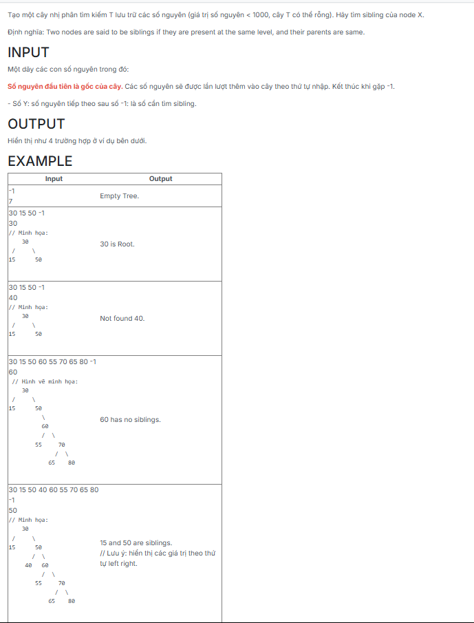

```c++
#include <bits/stdc++.h>

using namespace std;

struct NODE
{
    int key;
    NODE *pLeft;
    NODE *pRight;
};

typedef struct NODE *TREE;

TREE CreateNode(int x)
{
    TREE p = new NODE;
    if (p == NULL) exit(1);
    p->key = x;
    p->pLeft = p->pRight = NULL;
    return p;
}

void CreateEmptyTree(TREE &tree)
{
    tree = NULL;
}

void InsertNode(TREE &tree, int x)
{
    if (tree == NULL)
        tree = CreateNode(x);
    else if (x < tree->key)
        InsertNode(tree->pLeft, x);
    else
        InsertNode(tree->pRight, x);
}

void CreateTree(TREE &tree)
{
    int val;
    while (cin >> val && val != -1)
    {
        TREE p = CreateTNode(val);
        Insert(tree, p);
    }
}

void FindSiblings(TREE tree, int x)
{
    if (tree == NULL)
    {
        cout << "Empty Tree.";
        return;
    }

    if (tree->key == x)
    {    
        cout << x << " is Root.";
        return;
    }

    TREE parent = NULL, sibling = NULL;

    while (tree != NULL) {
        if (tree->pLeft && tree->pLeft->key == x) {
            parent = tree;
            sibling = tree->pRight;
            break;
        }
        if (tree->pRight && tree->pRight->key == x) {
            parent = tree;
            sibling = tree->pLeft;
            break;
        }

        if (x < tree->key) tree = tree->pLeft;
        else tree = tree->pRight;
    }

    if (parent == NULL) 
    {
        cout << "Not found " << x << ".";
    } else if (sibling == NULL) 
    {
        cout << x << " has no siblings.";
    } 
    else 
    {
       
        if (parent->pLeft && parent->pLeft->key == x)
            cout << x << " and " << sibling->key << " are siblings.";
        else
            cout << sibling->key << " and " << x << " are siblings.";
    }
}
int main() {
	TREE T;
	T = NULL; 
	CreateTree(T);

	int x;
	cin >> x;

	FindSiblings(T, x);

	return 0;
}

```