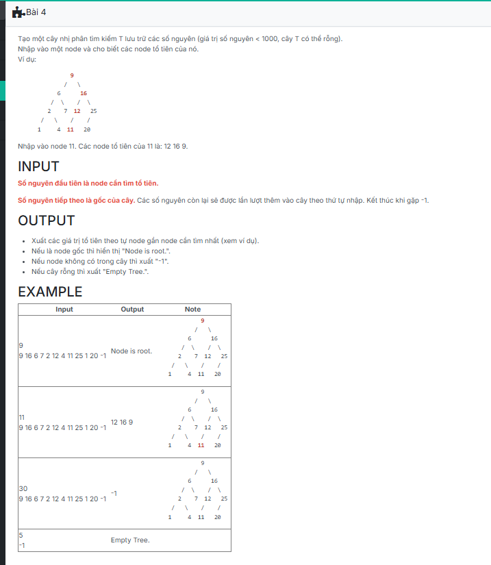

```c++
/*###Begin banned keyword - each of the following line if appear in code will raise error. regex supported
###End banned keyword*/

#include <iostream>
#include <queue>
using namespace std;

struct TNODE {
	int key;
	TNODE* pLeft;
	TNODE* pRight;
};
typedef TNODE* TREE;

void CreateEmptyTree(TREE &t)
{
    t = NULL;
}

TREE CreateNode(int x)
{
    TREE p = new TNODE;
    p->key = x;
    p->pLeft = p->pRight = NULL;
    return p;
}

void Insert(TREE &t, int x)
{
    if (t == NULL)
    {
        t = CreateNode(x);
        return;
    }
    else if (x < t->key) Insert(t->pLeft, x);
    else Insert(t->pRight, x);
}

void CreateTree(TREE &t)
{
    int val;
    while (cin >> val && val != -1)
    {
        Insert(t, val);
    }
}

bool PrintAncestors(TREE T, int x) 
{
    if (T == NULL) 
    {
        cout << "Empty Tree.";
        return false;
    }

    if (T->key == x) 
    {
        cout << "Node is root.";
        return true;
    }

    TREE current = T;
    int ancestors[1000]; 
    int idx = 0;

    while (current != NULL) 
    {
        if (x == current->key) 
        {
            break;
        }
        ancestors[idx++] = current->key;

        if (x < current->key)
            current = current->pLeft;
        else
            current = current->pRight;
    }

    if (current == NULL) 
    {
        cout << "-1";
        return false;
    }

    if (idx == 0) 
    {
        cout << "Node is root.";
    } 
    else 
    {
        for (int i = idx - 1; i >= 0; --i)
            cout << ancestors[i] << " ";
    }

    return true;
}

int main() {
	TNODE* T;
	int x;

	cin >> x;

	T = NULL;
	CreateTree(T);

	PrintAncestors(T, x);

	return 0;
}
```