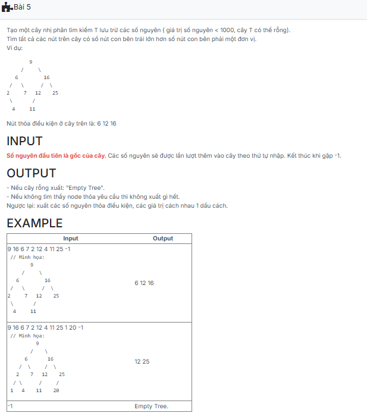

```c++
/*###Begin banned keyword - each of the following line if appear in code will raise error. regex supported
###End banned keyword*/

#include <iostream>
using namespace std;

struct TNODE {
	int key;
	TNODE* pLeft;
	TNODE* pRight;
};
typedef TNODE* TREE;

TNODE* CreateNode(int x) {
    TNODE* p = new TNODE;
    p->key = x;
    p->pLeft = NULL;
    p->pRight = NULL;
    return p;
}

void InsertNode(TREE& T, int x) {
    if (T == NULL) {
        T = CreateNode(x);
    } else {
        if (x < T->key)
            InsertNode(T->pLeft, x);
        else if (x > T->key)
            InsertNode(T->pRight, x);
    }
}

void CreateTree(TREE& T) {
    int x;
    while (cin >> x && x != -1) {
        if (x < 1000)
            InsertNode(T, x);
    }
}

int TongSoNodeTrai_LonHon_TongSoNodePhai_1dv(TREE T) {
    if (T == NULL) return 0;
    int leftCount = TongSoNodeTrai_LonHon_TongSoNodePhai_1dv(T->pLeft);
    int rightCount = TongSoNodeTrai_LonHon_TongSoNodePhai_1dv(T->pRight);
    if (leftCount == rightCount + 1) {
        cout << T->key << " ";
    }
    return 1 + leftCount + rightCount;
}


int main() {
	TREE T; //hay: TNODE* T;
	T = NULL; // Khoi tao cay T rong, or: CreateEmptyTree(T)

	CreateTree(T);

	if(T==NULL) cout << "Empty Tree.";
	else TongSoNodeTrai_LonHon_TongSoNodePhai_1dv(T);

	return 0;
}
```